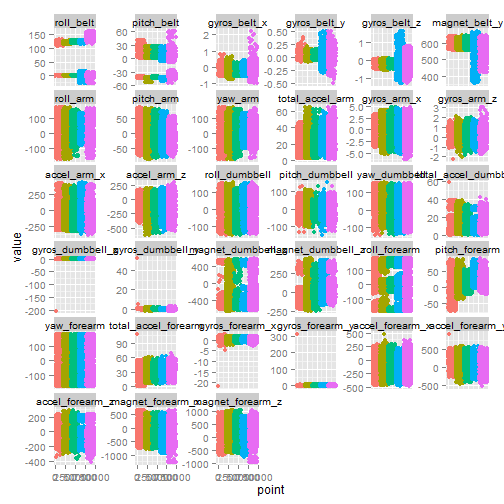

<!-- rmarkdown v1 -->

Data
=========
After downloading data files to local storage they are loaded as follows:


```r
trainData = read.csv(trainingFileDir, stringsAsFactors=FALSE)
testData = read.csv(testingFileDir, stringsAsFactors=FALSE)
```

Libraries Used
========
During course of the project following libraries used:

```r
library(caret)
```

```
## Loading required package: lattice
## Loading required package: ggplot2
```

```r
library(plyr)
library(reshape2)
library(Hmisc)
```

```
## Loading required package: grid
## Loading required package: survival
## Loading required package: splines
## 
## Attaching package: 'survival'
## 
## The following object is masked from 'package:caret':
## 
##     cluster
## 
## Loading required package: Formula
## 
## Attaching package: 'Hmisc'
## 
## The following objects are masked from 'package:plyr':
## 
##     is.discrete, summarize
## 
## The following objects are masked from 'package:base':
## 
##     format.pval, round.POSIXt, trunc.POSIXt, units
```

```r
library(corrplot)
library(ggplot2)
```

Removing incomplete attributes and preping data
=======
Original data set contains 19622 data rows and 160 columns.
Among them first 7 columns and last column are non-character, while the rest are numeric. Due to missing
data not all data loaded in numeric format. We convert them to numeric as follows:

```r
nonNumCols = c(-1:-7, -ncol(trainData))
trainData[,nonNumCols] = apply(trainData[,nonNumCols], 2, function(x) as.numeric(x))
testData[,nonNumCols] = apply(testData[,nonNumCols], 2, function(x) as.numeric(x))
```

Choosing attributes (predictors)
=======
Reducing number of predictors without sacraficing quality is the goal of this exercise.
Firstly, let's remove predictors that contain 1% or greater of NA values:

```r
N = dim(trainData)[[1]]
naCounts = sapply(trainData, FUN=function(x) sum(is.na(x)))
names01 = names(which(naCounts <= 0.01 * N))
trainData = trainData[, names01]
testData = testData[, c(names01[-length(names01)], "problem_id")]
```

Lastly, let's remove highly correlated predictors. If correlation between predictors
is above threshold of 0.75 (absolute value) then we remove 2d predictor as reduntant.


This is illustration of correlation relationships between predictors:

```r
corrMatrix = rcorr(as.matrix(trainData[,names01[c(-1:-7,-length(names01))]]))
corrplot(corrMatrix$r, type="upper", order="hclust", tl.col="black", tl.srt=45)
```

 


```r
# Remove highly correlated columns (cor > threshold)
threshold = 0.75
flattenCorrMatrix = flattenCorrMatrix(corrMatrix$r, corrMatrix$P)
colsToRemove = unique(flattenCorrMatrix[abs(flattenCorrMatrix$cor) >= threshold, 'column'])
trainData = trainData[, setdiff(names(trainData), colsToRemove)]
```
Plotting each predictor left by classes (colors). To make plot more manageable only 10% training
data displayed in plots (sampled randomly with equal class representation): 
 


Partition data
==========
Dividing data set into training and testing will alow us to validate resulting model
and estimate its out of sample error:

```r
# Partition data
inTrain = createDataPartition(y=trainData$classe, p=0.75, list=FALSE)
training = trainData[inTrain, -1:-7]
testing = trainData[-inTrain, -1:-7]
```

Random Forest Model with PCA
==========
Building Random Forest with pre-processing data using PCA attempts further 
reduce number of predictors while accounting for majority of variability in data
(using PCA). Random Forest model uses default configuration in caret:

```r
preProc = preProcess(training[,-ncol(training)], method="pca")
trainingPCA = predict(preProc, training[,-ncol(training)])
modelFitPCA = train(factor(training$classe) ~ ., method="rf", data=trainingPCA)
```

```
## Loading required package: randomForest
## randomForest 4.6-10
## Type rfNews() to see new features/changes/bug fixes.
## 
## Attaching package: 'randomForest'
## 
## The following object is masked from 'package:Hmisc':
## 
##     combine
```

```r
testingPCA = predict(preProc, testing[,-ncol(testing)])
```
Esimate of out of sample error for Random Forest with PCA:

```r
confusionMatrix(factor(testing$classe), predict(modelFitPCA, testingPCA))
```

```
## Confusion Matrix and Statistics
## 
##           Reference
## Prediction    A    B    C    D    E
##          A 1390    3    2    0    0
##          B    7  925   17    0    0
##          C    3   12  833    6    1
##          D    0    1   33  770    0
##          E    0    1    4   10  886
## 
## Overall Statistics
##                                           
##                Accuracy : 0.9796          
##                  95% CI : (0.9753, 0.9834)
##     No Information Rate : 0.2855          
##     P-Value [Acc > NIR] : < 2.2e-16       
##                                           
##                   Kappa : 0.9742          
##  Mcnemar's Test P-Value : NA              
## 
## Statistics by Class:
## 
##                      Class: A Class: B Class: C Class: D Class: E
## Sensitivity            0.9929   0.9820   0.9370   0.9796   0.9989
## Specificity            0.9986   0.9939   0.9945   0.9917   0.9963
## Pos Pred Value         0.9964   0.9747   0.9743   0.9577   0.9834
## Neg Pred Value         0.9972   0.9957   0.9862   0.9961   0.9998
## Prevalence             0.2855   0.1921   0.1813   0.1603   0.1809
## Detection Rate         0.2834   0.1886   0.1699   0.1570   0.1807
## Detection Prevalence   0.2845   0.1935   0.1743   0.1639   0.1837
## Balanced Accuracy      0.9957   0.9879   0.9658   0.9857   0.9976
```
While overall accuracy stands at 97.55%, results across outcome classes are not 
consistent: Class E sensitivty is 99.66% while Class D is only 92.60%.
Indeed, changing model to operate on predictors without PCA achieves better results:


```r
modelFitRF = train(factor(training$classe) ~ ., method="rf", data=training)
```
Estimate of out of sample error for Random Forest (no PCA):

```r
confusionMatrix(factor(testing$classe), predict(modelFitRF, testing))
```

```
## Confusion Matrix and Statistics
## 
##           Reference
## Prediction    A    B    C    D    E
##          A 1395    0    0    0    0
##          B    1  948    0    0    0
##          C    0    5  848    2    0
##          D    0    0   18  786    0
##          E    0    0    0    5  896
## 
## Overall Statistics
##                                          
##                Accuracy : 0.9937         
##                  95% CI : (0.991, 0.9957)
##     No Information Rate : 0.2847         
##     P-Value [Acc > NIR] : < 2.2e-16      
##                                          
##                   Kappa : 0.992          
##  Mcnemar's Test P-Value : NA             
## 
## Statistics by Class:
## 
##                      Class: A Class: B Class: C Class: D Class: E
## Sensitivity            0.9993   0.9948   0.9792   0.9912   1.0000
## Specificity            1.0000   0.9997   0.9983   0.9956   0.9988
## Pos Pred Value         1.0000   0.9989   0.9918   0.9776   0.9945
## Neg Pred Value         0.9997   0.9987   0.9956   0.9983   1.0000
## Prevalence             0.2847   0.1943   0.1766   0.1617   0.1827
## Detection Rate         0.2845   0.1933   0.1729   0.1603   0.1827
## Detection Prevalence   0.2845   0.1935   0.1743   0.1639   0.1837
## Balanced Accuracy      0.9996   0.9973   0.9887   0.9934   0.9994
```
Now, accuracy stands at 99.27% and class outcome statistics improved as well:
the best Class E sensitivity is 100% and the worst Class C sensitivity still
stands high at 97.26%. Each class also shows specificity 99.61% or even as 
hight as 100%. This result is quite satisfactory for this exercise.


